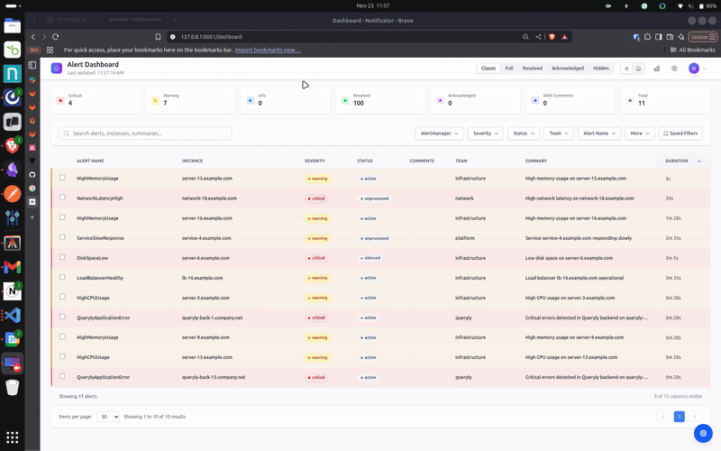

# Notificator

A web UI for managing alerts from multiple Prometheus Alertmanagers. Because checking five different Alertmanager UIs during an incident is nobody's idea of fun.

🚀 **Try it now at [playground.notificator.org](https://playground.notificator.org)** - no installation needed!



## What is this?

Notificator connects to all your Alertmanagers and shows everything in one place. Your whole team can see alerts, acknowledge them, add comments, and collaborate in real-time. Works on any device - laptop, phone, tablet, whatever.

**Key features:**
- Connect multiple Alertmanagers at once
- Real-time collaboration (acks, comments, assignments)
- OAuth login (Google, GitHub, Microsoft)
- Search, filter, and group alerts
- Alert history and statistics
- Light/dark theme
- Silence management

## Quick Start

```bash
# Clone and build
git clone https://github.com/soulkyu/notificator
cd notificator
go build -o notificator

# Start the backend (handles auth, database, team features)
./notificator backend

# In another terminal, start the WebUI
./notificator webui
```

Now open http://localhost:8081 and login with `admin:admin` (change this!).

The WebUI connects to localhost:9093 by default. To connect to your Alertmanagers, edit `~/.config/notificator/config.json`:

```json
{
  "alertmanagers": [
    {
      "name": "production",
      "url": "http://prod.alertmanager:9093"
    },
    {
      "name": "staging",
      "url": "http://staging.alertmanager:9093"
    }
  ]
}
```

## Architecture

The WebUI needs the backend to work. Here's why:

```
┌──────────┐
│  WebUI   │ ← What you see in the browser
│ :8081    │
└────┬─────┘
     │
┌────▼─────┐
│ Backend  │ ← Handles everything: auth, database, real-time sync
│ :50051   │
└────┬─────┘
     │
┌────▼─────────────┐
│ Database + OAuth │
└──────────────────┘
```

The backend stores alert history, manages user sessions, syncs everything in real-time, and handles OAuth. Without it, the WebUI won't work.

## Configuration

### Multiple Alertmanagers

Got alerts in prod, staging, and that weird legacy system? Connect them all:

```json
{
  "alertmanagers": [
    {
      "name": "production-us",
      "url": "http://prod-1:9093"
    },
    {
      "name": "production-eu",
      "url": "http://prod-2:9093"
    },
    {
      "name": "that-legacy-thing",
      "url": "http://10.0.0.42:9093",
      "username": "admin",
      "password": "change-me"
    }
  ]
}
```

Each alert shows which Alertmanager it's from.

### OAuth Authentication

```bash
export OAUTH_ENABLED=true
export OAUTH_PROVIDER_GOOGLE_CLIENT_ID="your-client-id"
export OAUTH_PROVIDER_GOOGLE_CLIENT_SECRET="your-secret"
export OAUTH_REDIRECT_URL="http://localhost:8081/oauth/callback"

./notificator backend
```

Supports Google, GitHub, and Microsoft. Check `docs/oauth/` for setup details.

### Database

By default, the backend uses SQLite. For production, use PostgreSQL:

```json
{
  "backend": {
    "database": {
      "type": "postgres",
      "host": "localhost",
      "port": 5432,
      "name": "notificator",
      "user": "notificator",
      "password": "secret"
    }
  }
}
```

## Deployment

### Docker Compose (easiest)

```bash
docker-compose up -d
# WebUI at http://localhost:8081
```

### Kubernetes (production)

```bash
# Install from GitHub Container Registry
helm install notificator oci://ghcr.io/soulkyu/notificator --version 0.1.0

# Or customize
helm install notificator oci://ghcr.io/soulkyu/notificator --version 0.1.0 \
  --set webui.ingress.host=notificator.yourcompany.com \
  --set backend.env.NOTIFICATOR_BACKEND_DATABASE_TYPE=postgres
```

### Old school (just run the binaries)

```bash
./notificator backend &
./notificator webui &
```

Use systemd or supervisor to keep them running.

## Why I built this

I was on-call and kept missing alerts because:
1. The default Alertmanager UI is... functional
2. Switching between multiple Alertmanagers during incidents sucked
3. No way to see who was handling what
4. No collaboration features

So I built this. Then my team started using it. Then we added real-time collaboration. Now when an alert fires, everyone sees it instantly. When someone acks it, everyone knows. No more "are you handling this?" messages in Slack.

## Contributing

PRs welcome! The code is straightforward:
- `internal/webui/` - Web UI (Go + Templ + HTMX + Alpine.js)
- `internal/backend/` - Backend server (gRPC + PostgreSQL/SQLite)
- `internal/alertmanager/` - Alertmanager client
- Tech stack: Go, Gin, Templ, HTMX, Alpine.js, Tailwind CSS

No npm, no webpack, no 10,000 dependencies.

---

*PS: Yes, the code could be cleaner. Yes, there should be more tests. But it works, and that's what matters when you're on-call.*
